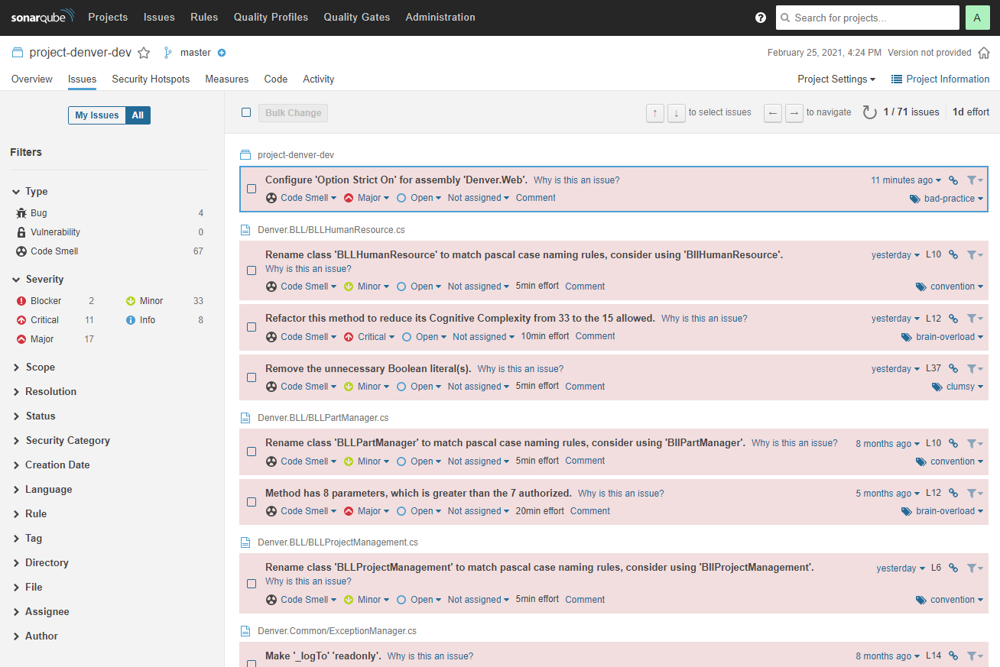

> :warning: Dikkat. Bu çalışma, teknik borcu yüksek bir uygulamayı tasvir etmek üzere planlanmıştır. Yazılımcı adaylarının bu teknik borcu hafifletmek için gerekli OOP pratiklerini uygulaması beklenmektedir.

# Project-Denver

Denver, Brezilya'nın en büyük elektrik süpürge malzemeleri üreticisi için 2000li yılların başında yazılmış bir ERP ürünüdür. Ürün kataloglama, satış, faturalama, yedek parça tedariki gibi modülleri olup dünya çapında 800den fazla bayii tarafından kullanılmaktadır.

## Ürünün Genel Özellikleri ve Kullandığı Teknolojiler

Denver, Microsoft .Net 1.1 ile geliştirilmeye başlanmış ve nihayi güncel sürümünde .Net 4.0'a geçirilmiş bir üründür. N-Tier mimariye uygun olacak şekilde tasarlanmış olup SQL Server veritabanı ile birlikte çalışmaktadır. İş kuralları kod ve SQL Sp nesnelerine dağıtılmış durumdadır.

## Oyun Alanı

Projeyi indirdikten sonra teknik borç detayını görmek için belki de SonarQube ile birlikte çalışmayı deneyebilirsiniz. Bu sayede başarılı şekilde build olan çözümün kodsal sorunlarınları görebilir SonarQube'u öğrenebilir ve gerekli tedbirleri daha rahat alabilirsiniz. Söz gelimi aşağıdaki gibi bir sorun listesi ile çalışma fırsatınız olabilir.

ve hatta projenin kalitesini ölçebilirsiniz.

Ancak tabii ki bazı şeyler SonarQube tarafından da fark edilemeyebilir. Söz gelimi mimari kararlar, loglama ve monitoring stratejilerinin belirlenmesi, servislerin konumlandırılması, modüler hale gelebilirlik vs