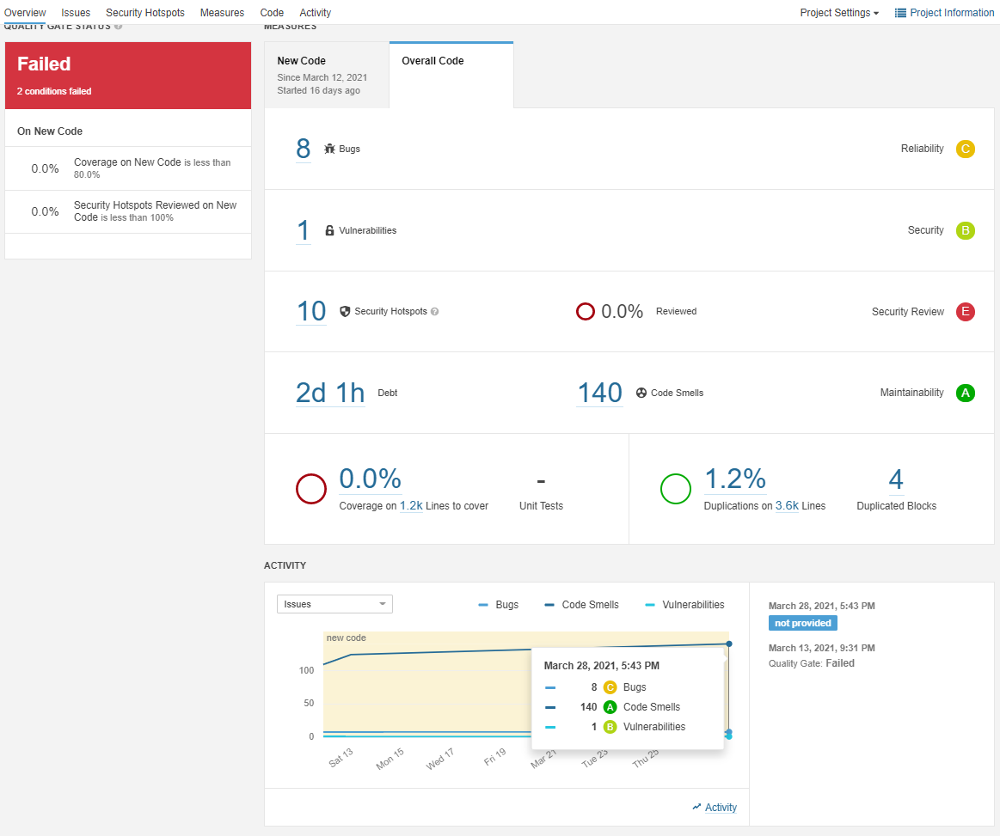

> :warning: Dikkat. Bu çalışma, teknik borcu yüksek bir uygulamayı tasvir etmek üzere planlanmıştır. Yazılımcı adaylarının bu teknik borcu hafifletmek için gerekli OOP pratiklerini uygulaması beklenmektedir.

# Project-Denver

Denver, Brezilya'nın en büyük elektrik süpürge malzemeleri üreticisi için 2000li yılların başında yazılmış bir ERP ürünüdür. Ürün kataloglama, satış, faturalama, yedek parça tedariki gibi modülleri olup dünya çapında 800den fazla bayii tarafından kullanılmaktadır.

## Ürünün Genel Özellikleri ve Kullandığı Teknolojiler

Denver, Microsoft .Net 1.1 ile geliştirilmeye başlanmış ve nihayi güncel sürümünde .Net 4.0'a geçirilmiş bir üründür. N-Tier mimariye uygun olacak şekilde tasarlanmış olup SQL Server veritabanı ile birlikte çalışmaktadır. İş kuralları kod ve SQL Sp nesnelerine dağıtılmış durumdadır.

## Oyun Alanı

Projeyi indirdikten sonra teknik borç detayını görmek için belki de SonarQube ile birlikte çalışmayı deneyebilirsiniz. Bu sayede başarılı şekilde build olan çözümün kodsal sorunlarınları görebilir SonarQube'u öğrenebilir ve gerekli tedbirleri daha rahat alabilirsiniz. SonarQube'u kullanmak için Docker imajından yararlanılabilir. Aşağıdaki terminal komutu ile onu sistemimize ekleyebiliriz.

```bash
docker run -d --name sonarqube -e SONAR_ES_BOOTSTRAP_CHECKS_DISABLE=true -p 9000:9000 sonarqube:latest
```

Sonrasında http://localhost:9000 adresine giderek giriş yapabiliriz. Başlangıçta kullanıcı adı ve şifre _admin_ olarak belirlenmiştir. Bunu değiştirip ilerleyiniz. Sonarqube üstünden proje oluşturulduktan sonra taramam için bir Token oluşturmak gerekir. _(SonarQube taraması için sistemde Sonar-Scanner da olmalıdır. Bunu indirip zip dosyasını açtıktan sonra SonarScanner.MSBuild'un olduğu fiziki yol bilgisi, sistem genel path tanımınına eklenmelidir)_ Aşağıdaki terminal komutları project-denver için bir taramanın nasıl yapıldığını örneklemektedir.

```bash
SonarScanner.MSBuild.exe begin /k:"project-denver-dev" /d:sonar.host.url="http://localhost:9000" /d:sonar.login="3f5f3ede038224c9........"
MsBuild.exe /t:Rebuild
SonarScanner.MSBuild.exe end /d:sonar.login="3f5f3ede038224......"
```

Projeye kodlar eklendikçe ortaya aşağıdakine benzer sonuçlar çıkacaktır.

İlk etapta her şey yeşil görünebilir.


Sonra ise aşağıdakine benzer bir seyir ortaya çıkabilir.





Ancak tabii ki bazı şeyler SonarQube tarafından da fark edilemeyebilir. Söz gelimi mimari kararlar, loglama ve monitoring stratejilerinin belirlenmesi, servislerin konumlandırılması, modüler hale gelebilirlik vs